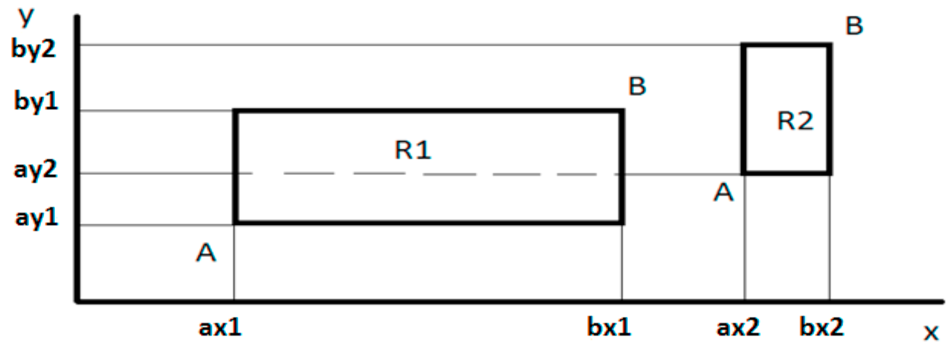

# Операції порівняння.
#### Типи даних `boolean`. Оператори `if` та `if-else`. Логічні функції `NOT`, `AND`, `OR`. Використання операторів розгалуження та логічних функцій для розв’язку завдання про перетин прямокутників.

За допомогою операторів розгалуження та логічних функцій `AND`, `OR` визначити тип перетину двох прямокутників `R1` та `R2` із
сторонами, що є паралельними вісям координат. Прямокутники задано координатами двох діагональних вершин `А` та `В`:

`int ax1, ay1, bx1, by1` – для прямокутника `R1`,  
`int ax2, ay2, bx2, by2` – для прямокутника `R2`:

Для зменшення громіздкості коду припускаємо, що точка А має бути завжди нижче та лівіше точки В.
Написати Java-код для визначення типу перетину з п’яти можливих варіантів:
*  Перетину немає
*  Перетином є крапка
*  Перетином є вертикальна лінія
*  Перетином є горизонтальна лінія
*  Перетином є прямокутник

Рекомендовано обрати саме вищенаведену послідовність варіантів, а також кожний фрагмент коду для визначення певного типу перетину оформити у вигляді автономного відокремленого блоку операторів if-else.
