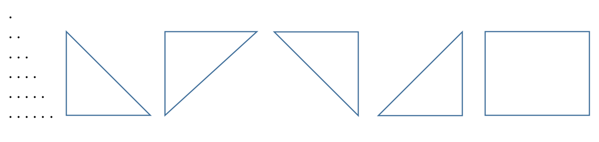

# Цикли
#### Оператор `for`. Область видимості змінної. Вкладені цикли. Оператори `while` та `do-while`. Виведення крапкових трикутників. Використання циклічних операторів для розв’язку завдань шкільних підручників з математики.

Програмне завдання 1:

1. До числа 35 дописати ліворуч і праворуч по одній однаковій (інший варіант завдання - довільній) цифрі такій, щоб утворене число було кратним довільному заданому натуральному числу.
2. Знайти всі натуральні числа x , що задовольняють рівнянню
92abc = 874 * x. 
Ліворуч стоїть п'ятицифрове число (a, b, c – цифри в межах 0...9).
3. Скільки існує пар (a, b) натуральних чисел, менших 200, таких, що сума a*a + b*b ділиться на 49?
4. Від тризначного числа відняли суму кубів його цифр. Який найбільший результат міг при цьому вийти?
5. Скільки існує натуральних чисел таких, які можна подати у вигляді суми двох тризначних чисел cba + abc, (a і с не рівні 0)? (Приклад: 1595 = 748 + 847).

Програмне завдання 2:

Реалізувати виведення примітивних крапкових трикутників нижченаведених конфігурацій, а також прямокутника:

Програмне завдання 3:

Із використанням алгоритмів виведення примітивних “вертикальних” трикутників та прямокутника, створених у завданні 2, реалізувати формування складених рівнобедрених “вертикальних”трикутників, паралелограмів та “вертикальних” трапецій наступних конфігурацій:

Програмне завдання 4:

Реалізувати виведення примітивних крапкових “горизонтальних” трикутника та трапеції:

Програмне завдання 5:

із використанням алгоритму виведення примітивного “горизонтального” трикутника, створеного у завданні 3, реалізувати виведення крапкових трикутників, розміщених вертикально (“ялинку”):

Передбачити можливість побудови “ялинки” з трикутників різного розміру та з різними символами формування (“крапками”), зміну кількості трикутників для формування “ялинки”, а також можливість зсуву “ялинки” вправо на задану кількість кроків.
