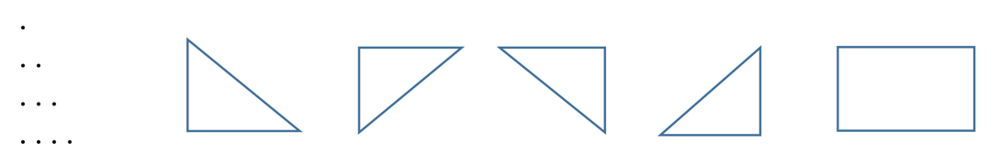

# Тема: MVC
#### Оператори ділення за модулем `%`, інкремента, декремента, операцій з присвоєнням, тернарний оператор. Логічна функція `XOR`, `short-circuit` логічні функії. Оператори `switch-case`, `break`, `continue`, `foreach`.
#### Поняття інкапсуляції, структура класу. Створення власних класів. Оголошення та ініціалізація полів. Оголошення методів. Оголошення та створення об’єктів. Оператор `new`. Літерал `null`. Архітектурний шаблон `MODEL-VIEW-CONTROLLER` (`MVC`) для побудови власних класів. Приклад побудови класу Calculator. Ознайомлення із конструкторами, передаванням в метод посилань на об’єкти.

Програмне завдання 1.
За вимогами шаблону `MVC` реалізувати виведення крапкових геометричних фігур статичними методами об’єднаного класу `ControllerAndView`, в тому числі методами декількох рівнів вкладеності:
- `рівень 0`: два методи для виведення: лінійки пробілів та лінійки символів;
- `рівень 1`: п’ять методів для виведення прямокутника та простих крапкових трикутників наступних конфігурацій (у всіх п’яти методах використати виклики методів рівня 0):

а також метод для виведення горизонтальних трикутника та трапеції наступних конфігурацій (використати виклики довільних методів рівнів 0...2), врахувати, що горизонтальний трикутник є частковим випадком горизонтальної трапеції:

- `рівень 2`: чотири методи для формування складених рівнобедрених трикутників, паралелограмів та трапецій наступних конфігурацій (у всіх чотирьох методах використати виклики методів рівня 1), врахувати, що чотири фігури, наведені зліва є частковими випадками чотири фігур, наведених справа:

- `рівень 3`: два методи для виведення “ялинки”, “ракети” наступних конфігурацій (використати виклики довільних методів рівнів 0...2):

  У методах рівнів 1...3 передаванням відповідних параметрів забезпечити зміну геометричних розмірів крапкових фігур, символів для формування фігур, а також можливість зсуву фігур вправо на задану кількість кроків.
  У якості параметрів методів переважно використовувати посилання на об’єкти класів Triangle, Rectangle (тип Model згідно вимог шаблону MVC).

[Відео урок](https://youtu.be/P_ksscyFhF0) 17.11.2022
